登录

大厅

游戏里


```js
这些都是与store.js耦合的
本地存储：
用户ｉｄ：
ｔｏｋｅｎ
//websocket各种请求,和store.js耦合，get_me_id获取我的游戏的id,自己和别人摸牌,自己选择一个选择，获取分数，倒计时，退出
／／在ｇａｍｅ．ｖｕｅ的ｃｈｅｃｋｄａｔａ函数里面写ｄａｔａ．ｔｙｐｅ，然后进ｃｏｍｍｉｔ，
／／ｓｔｏｒｅ．ｊｓ部分已经完成
获取我的游戏ｉｄ
自己摸牌＄ｓｔｏｒｅ．ｓｔａｔｅ．ｍｅ．ｐｌａｙｅｒ＿ｉｄ
别人摸牌
ｎｕｍｂｅｒ
摆放搁置的牌，在ｓｔｏｒｅ里面＄ｓｔｏｒｅ．ｓｔａｔｅ．ｍｅ．ｄｉｓｃａｒｄｅｄ＿ｃａｒｄ
获取分数　接受消息ｐｏｉｎｔｓ数组

选择，接收消息，获取选项ｏｐｔｉｏｎｓ
倒计时，不断接收消息，更新前端的倒计时数字＄ｓｔｏｒｅ．ｔｉｍｅ，未完成接受消息部分
退出游戏
//加入牌局，创建牌局

//加入大厅
ｌｏｇｉｎ．ｖｕｅ里的ｍｅｔｈｏｄｓ的ｌｏｇｉｎ和ｃｌｉｃｋ方法代表登录和注册，通过发送ｐｏｓｔ请求进行注册和登录，同源策略？
登录：根据ｌｏｃａｌｓｔｏｒａｇｅ的ｆｌａｇ是否为ｔｒｕｅ决定是否需要登录，如果为ｆａｌｓｅ，就进行一次Ｐｏｓｔ请求，如果为ｔｒｕｅ就直接
        this.$router.push("/ｈａｌｌ");
登录后自动加入大厅,在login界面发送请求
登录成功后路由跳转，存储ｔｏｋｅｎ和用户ｉｄ
接受消息获取所有牌局的列表，
可以选择点击加入一个牌局，创建一个牌局
house里join函数加入牌牌局，发送自己账号的user_id和加入牌局的number
创建牌局，在hall.vue里创建牌局
//退出登录

```

```c++
//啊，如何进行post请求????
login登录时,注册时，创建牌局时，加入牌局时
```


```js
    click(){
      //发送post请求
      this.$http.post('http://198.211.12.166:23333/register', {
        name: this.r_name,
        user_id: this.r_user_id,
        email: this.r_email,
        password: this.r_password
      }).then(()=> {
        console.log("接受数据");
        this.loginBox.style.display = "block";
        this.registerBox.style.display = "none";
        alert("注册成功");
      }).catch(
          function (error) {
            const pipei={
                "ensure this value has at most 7 characters":"昵称最多7位",
              "string does not match regex \"^[a-zA-Z\\u4e00-\\u9fa5]+$\"":"请输入昵称",
              "ensure this value has at least 5 characters":"ID至少包含5个字符",
              "value is not a valid email address":"不是正确的邮箱地址",
              "ensure this value has at least 8 characters":"密码至少八位",
              "该邮箱已存在":"该邮箱已存在"
            }
            var i=0;

              if(typeof error.response.data.detail=="string"){
                alert(error.response.data.detail);
              }else {
                while (error.response.data.detail[i]) {
                  if (pipei[error.response.data.detail[i].msg]) {
                    alert(pipei[error.response.data.detail[i].msg]);
                  } else {
                    alert(error.response.data.detail[i].loc[1]);
                    alert(error.response.data.detail[i].msg)
                  }
                  i++;
                }
                this.getElementById("r_error").display = "block";

              }
          });
    }
```

```js
    login(){
      //当地存储没有flag的时候要去拿存储或者登录用户与已登录用户不匹配时去拿数据
      if(window.localStorage.getItem("flag")!=="true") {
        this.axios.post('http://198.211.12.166:23333/login',
            {
          user_id: this.user_id,
          password: this.password
        },
            {
              headers:{
                "Access-Control-Allow-Origin":"*"
              }
            }).then(()=> {
              // eslint-disable-next-line no-undef
              window.localStorage.setItem('hall',true)
                this.$router.push("/hall");
                alert(1);
              }
            ).catch(
            function (error) {
              window.localStorage.setItem('hall',true)
              


              // const pipei={
              //   "field required":"需要输入"
              // }
              alert(error);
            //   if(error!==null){
            //   var i=0;
            //   while (error.response.data.detail[i]) {
            //     if (pipei[error.response.data.detail[i].msg]) {
            //       alert(pipei[error.response.data.detail[i].msg]);
            //     } else {
            //       alert(error.response.data.detail[i].loc[1]);
            //       alert(error.response.data.detail[i].msg)
            //     }
            //     i++;
            //   }
            // }else{
            //     console.log("成功");
            //     this.$router.push("/game");
            //   }
            }
        );
      }else{
        window.localStorage.setItem('hall',true);
        this.$router.push("/hall");
      }


    },
```

```js
//路由守护???为什么我进不去大厅?
```

```js
获取token，登录时
```


```js
前后端对接
token部分登录时候，储存token
登出需要
牌桌列表
创建牌桌
加入牌桌
```

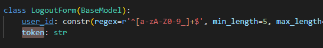

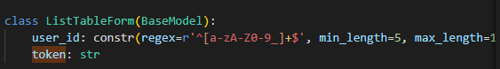

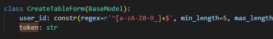

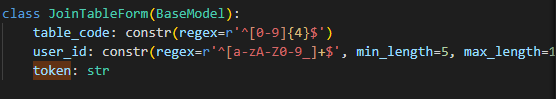

## 登录

### login

本地存储：
用户ｉｄ：user_id
ｔｏｋｅｎ

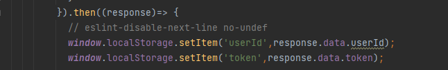


这段代码位置不对，应该在返回数据判断后再跳转

### register

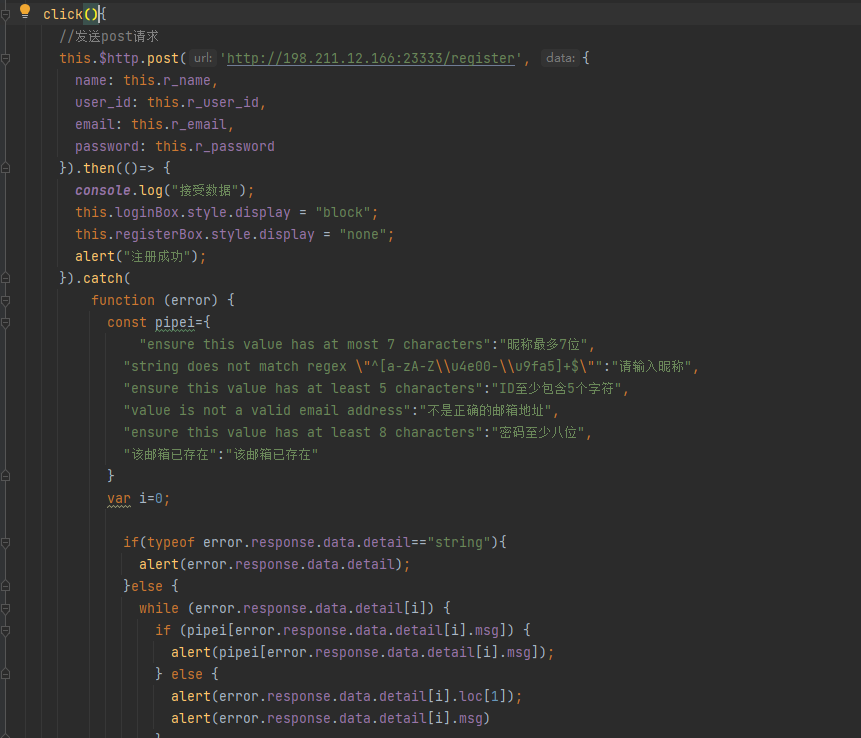

## 大厅:

### 退出hall.vue

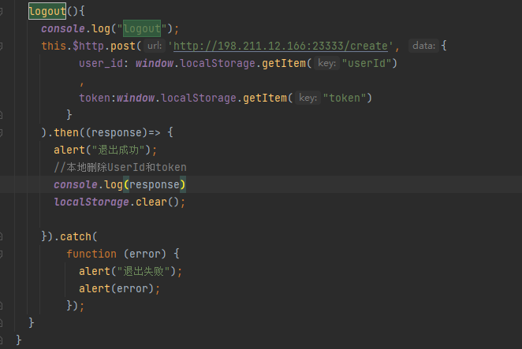

### 创建牌桌 hall.vue

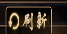

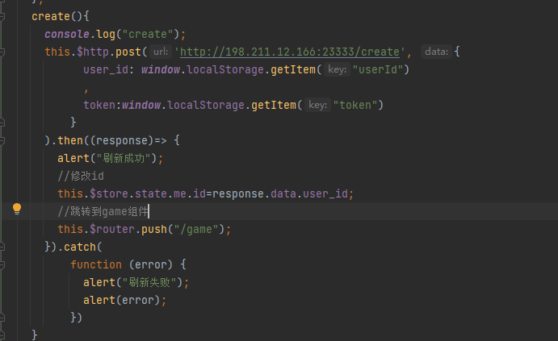


这个位置有点问题，应该在数据发过来判断后再决定是否跳转

### 加入牌桌house.vue

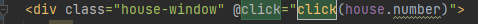

点击后把table_code牌桌号发过去

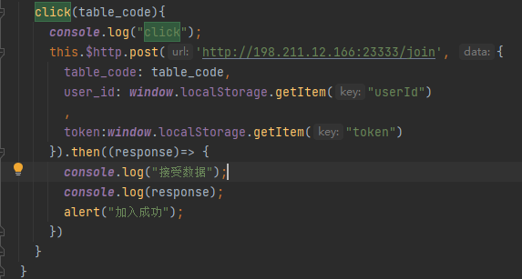


这个位置有点问题，应该在结果发过来判断后再跳转

### 刷新hall.vue

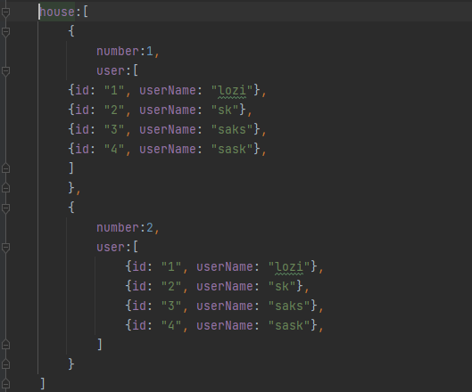

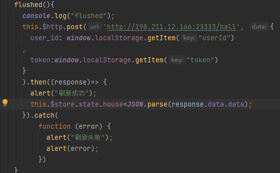

重新发送hall的post请求✓

将返回的数据存入store.js✓

然后会自动解析，展示出来


完成前端展示

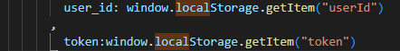

## 游戏内

### 未开始

一切默认为空，并且有一个灰框框等待其他玩家加入

#### 玩家加入


```js
      else if(data.type==="join"){
        this.$store.commit("join",data.data);
      }
```

##### 自己加入(阻塞)

自己加入房间后需要初始化房间里有哪些玩家的信息，要不从house列表拿,要不后端发一次你加入的房间信息，看具体如何实现

##### 其他人加入

有玩家加入房间后后要更新玩家列表的信息，

```json
{
            "type":"join",
            "data":self.player[-1].to_dict()
        }

{
            "name": self.name,
            "user_id": self.user_id,
            "email": self.email,
            "total_score":self.total_score,
            "in_table":self.in_table
        }
```

### 游戏开始

#### 初始化√

表示游戏开始，修改两次信息

store.js

开始

```js
    start(state){
        state.started=1;
    },
```

初始化

```js
    init(state,info){
        //初始化
        state.me.name=info.self.name;
        state.me.user_id=info.self.user_id;
        state.me.p_tiles=info.self.close;
        state.me.open=info.self.open;
        state.me.discarded_card=info.self.discard;
        state.me.score=info.self.score;
        const position = {
            "-1" : "left",
            "1" : "right",
            "2" : "front",
            "-2" : "front"
        };
        for (let i = 0; i < 4; i++) {
            if(state.me.user_id===info.table[i].user_id){
                state.me.player_id=i;
                break;
            }
        }
        for (let i = 0; i < 4; i++) {
            if(i!==state.me.player_id){
                var str = i-state.me.player_id.toString();
                state[position[str]].player_id=i;
                state[position[str]].name=info.table[i].name;
                state[position[str]].user_id=info.table[i].user_id;
                state[position[str]].total_score=info.table[i].total_score;
                state[position[str]].number=13;
            }
        }
    },
```


#### 打牌√

##### 判断是否可以打牌

##### 打牌发消息

#### 摸牌√

##### 自己摸牌

##### 其他人摸牌

#### 倒计时 √

##### 准备前的倒计时√ game/notStarted.vue

##### 准备后的倒计时√ game/timeContainer.vue

接收到消息，开启展示窗口

倒计时为0，关闭展示窗口

#### 其他人吃碰杠(阻塞)

后端没写

#### 选择(阻塞)

要判断一下是否有多个吃，如果有多个吃，点一下吃会展示用哪几张牌去吃

缺少碰的静态资源

在store里有一个数组options，我们添加，做完选择后把options清空

#### 余 game/mid.vue√

游戏开始后才展示出来

自己写逻辑，有人摸牌，就让余减少

写一个逻辑,有一个余的数字，有一个余的数组，

余的数组把每一位的数字存起来，好像不太行，因为余变化，余的数组也要变化，

有没有办法能让余的数组跟随余变化?

或者是直接修改数组?

#### 分数 

四个分数

#### 吃 game/buttonContainer.vue

#### 碰 game/buttonContainer.vue

#### 杠 game/buttonContainer.vue


## 新加

### 没有push，记住改了哪些东西

### notstarted.vue 

"type":"ready"

### hall.vue 

 this.$router.push("")顺序

### login.vue

添加确认密码 r_password1:"",

需要确认密码和密码一致

新加返回按钮

logo好像会挡住输入框，点击没用,改一下

```html
<div style="position:relative">
    
    
</div>
```

### 添加路由守护

## 问题

实现打出的牌的静态资源

## 新加

```json
Received message: {"type": "update_info", "data": {"self": {"name": "lozijy", "user_id": "12345", "close": ["7m", "5p", "2m", "5s", "7m", "4s", "8s", "1s", "8m", "6p", "3p", "7s", "2p"], "open": [], "draw": null, "discard": [["3s", false], ["1m", false], ["3s", false], ["9p", false], ["9p", false], ["7s", false]], "score": 100}, "table": [{"name": "lozijy", "user_id": "12345", "open": [], "draw": null, "discard": [["3s", false], ["1m", false], ["3s", false], ["9p", false], ["9p", false], ["7s", false]], "score": 100}, {"name": "loij", "user_id": "12344", "open": [], "draw": null, "discard": [["9m", false], ["2m", false], ["8m", false], ["8m", false], ["6p", false]], "score": 100}]}, "rest_tile": 71}
```

### 打牌✓

三个变量

```shell
change
history
	count
	last
```

通过点击改变vue对象,要记录用户是否打牌，要记录用户点击了哪张牌，重复点击一张牌是选择打牌，第一次点击是把牌立起来，同时记录，第二次点击

```js
//监听  
//监听flag,如果flag为true,就打牌
flag: function(newValue, oldValue) {
        console.log(newValue+oldValue);
        if(newValue===true) {
          // do something with the new value
          this.go(this.history.last);
          this.$root.flag = false;
        }
      },    
//监听change,如果值为空，就把上一张牌打出去
    change: function(newValue, oldValue) {
      console.log(newValue+oldValue);
        alert("change");
      if(newValue==="") {

        // do something with the new value
        this.$refs[oldValue].classList.toggle("move");
      }
      else{
        this.$refs[oldValue].classList.toggle("move");
        this.$refs[newValue].classList.toggle("move");
      }
    },
```


click(history,change,tile)

```js
  click(history,change,tile){
      //第一次点击，change记录选择了哪张牌,count=1表示用户点击了牌,last记录选择了哪张牌
    if(history.count===0){
      change=tile;
      history.count=1;
      history.last=this.tile;
    }
      //第二次或以上
    else{
        //如果点击了同一张牌，就打出
      if(history.last===this.tile){
        history.count=0;
        change="";
        history.last=this.tile;
        console.log(this.$root);
        // this.$emit('updateFlag', true);
      }else{
        change=tile;
        history.last=this.tile;
      }
    }
  },
```


### 接受到可以打牌的信息后可以打牌✓

### sort函数修改✓

### action_choose优化

不是吃，一定能展示，是吃，展示一个	

```html

```

展示一个chi后修改flag

算了，直接修改store.js吧

### 牌的位置优化✓

### 分数

### 玩家列表✓

store添加了一个people列表,大厅加入时修改people,退出时修改people和number为空

### 路由守护

### 结束界面，返回按钮

### 退出当前页面应该断开ws连接

### 加个庄家，可以打牌的时候变量


